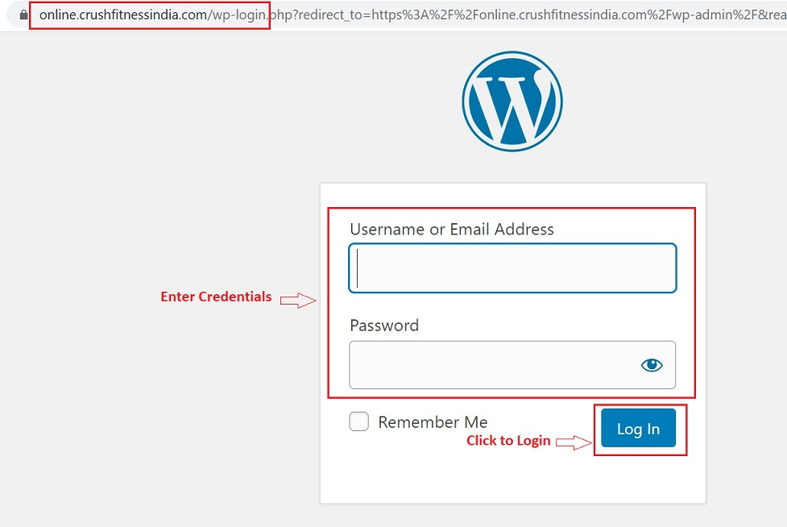

## **_Introduction_**

The Admin manual has been created for the Admin team of Crush Fitness India. The purpose of this is to:

*   increase productivity by reducing time spent in asking questions and waiting for a response.
*   provide valuable assistance in training new employees.
*   provide instructions on how to create different classes and manage the same.

### **_Login - Admin Panel_**

*   Go to online.crushfitnessindia.com/wp-admin
*   Enter the User id and password
*   Click on Log In

### **_Login Credentials_**

*   Username: Crushfitness
*   Password: rYn)uuqio#ACb$89s&rhFWgm

Please note: the login credentials are case sensitive and have to be entered in the given format.

### **_List of admin tasks_**

In this manual we will cover step-by-step instructions for the below tasks:

*   [Zoom Single Class](Zoom-Single-Class.md)
*   Pre Recorded Class
*   Category Creation
*   Lessons & Videos
*   Program Sections
*   Custom Fitness Programs
*   FAQs
*   Order Details
*   Customer Details
*   Customer Questionnaires

