## **Zoom Single Class**

### **_Introduction_**

Zoom class is an interactive class which enables the customers to take care of their fitness goals from anywhere, anytime.

Below is the step-by-step guide to create Zoom Classes.

### **_Create Zoom meeting_**

*   Go to online.crushfitnessindia.com/wp-admin
*   Login with the given credentials.
*   Click on Zoom Meeting

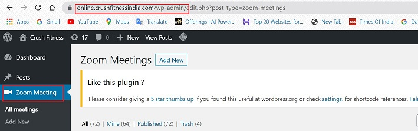

*   Click on Add new

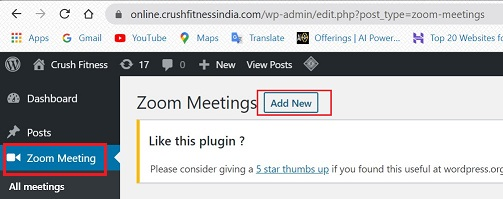

*   Enter Name of Class

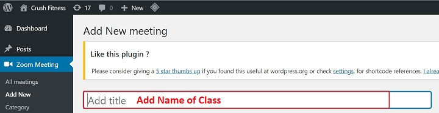

*   Enter Start Date & Time
*   Enter Duration
*   Enter Password to join meeting

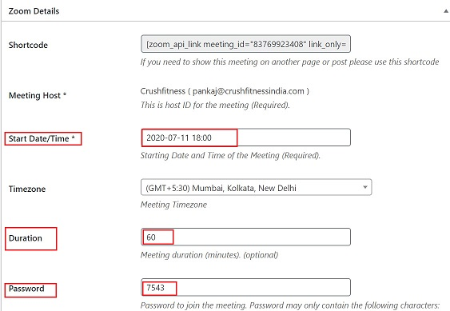

*   Check mark the below options:

    *   Join Before Host
    *   Participant Video
    *   Mute Participants Upon Entry

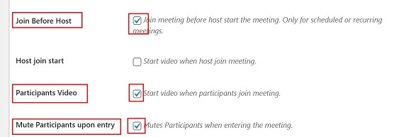

*   On the right side panel:

    *   Go to Category
    *   It should be marked as "Group"

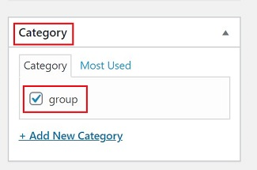

*   Tick the Enable Purchase check box

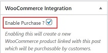

*   Click on Regular Price and enter an amoumt

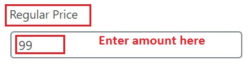

*   Click on Publish

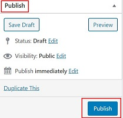

*   Once the meeting is published, a Product id is created. 

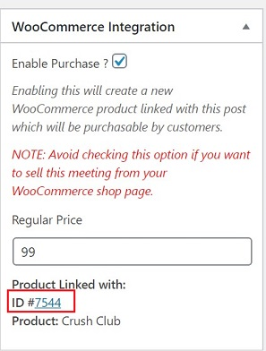

### **_Create Product for the related Product id_**

*   Click on the Product id. You will be directed to the Product screen.

*   On the Product page:

    *   Enter name in the name field.

    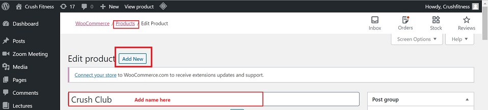

    *   Go to Product Field:
        *   Enter the Date & Time for the class

        

        *   Choose Type of class

        

    *   Go to Product Data -> Zoom Meeting

        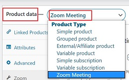

    *   In the Zoom Connection field -> Enable Zoom Connection.

    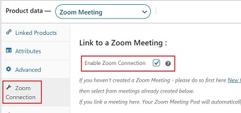

*   Product page -> Right side panel:

    *   Go to Product Categories -> Group Fitness -> Single Zoom CLass

    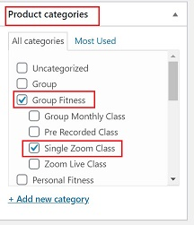

*   Click Publish to save the settings.

