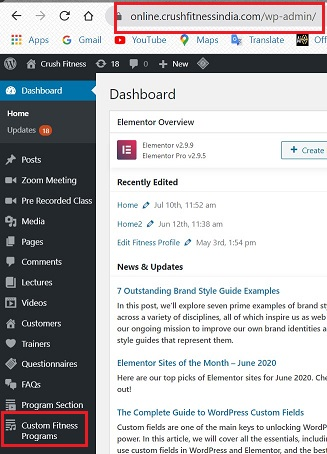
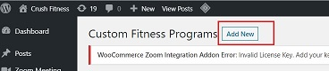
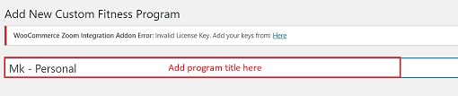
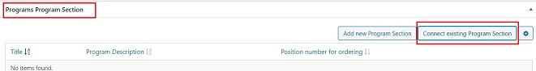
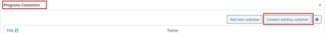
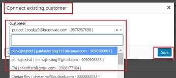
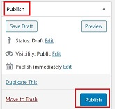

# **Custom Fitness Program**

To create the Custom Fitness plan, the final step is to create the program which will link the respective lectures and program sections. In this section, we will see how to do the same

## **Create Custom Fitness Program**

*   Go to <a href="https://www.mycrush.fit/wp-admin" target="_blank">**mycrush.fit/wp-admin**</a>
*   Login with the credentials.
*   Click -> **Custom Fitness Program** tab on left side panel

   

###   **Add New**

*   Click -> **Add New**

   

## **Custom Program Settings**

###   **Add Title**

*   Enter Name for the program

   

### **Programs Fields**

Update the below field under this section:

####  **Programs Image** 

-  Upload the program image which will show on the frontend.

   

### **Programs Program Section**

In this section:

-   Connect existing program section
-   Sequence of the program section should be maintained - this is 

####  **Connect Existing Program Section**

1. Click -> **Connect existing Program Section**
2. Choose the program from the list
3. Enter the Position number - This decides the sequence in which the Program sections will appear on frontend.
4. Click -> **Save**

**Result:** On the frontend, Program Sections are displayed as below:

### **Programs Customers**

In this section:

-   Connect existing Customers
-   Sequence of the program should be maintained

####  **Connect Existing Customer**

1. Click -> **Connect existing customer**
2. Choose the customer name from the list
3. Make sure you choose the customer name with details like email id and phone number.
4. Click -> **Save**

## **Publish**

Once all the connection is done:

-   Click on Publish on the right side panel.
-   Changes will be saved.

## :warning: **Caution**

Keep in mind the below warnings:

-   Do not allot one customer's program section to the other customer.
-   Doing so, the program section from the original customer's profile will get disconnected.

