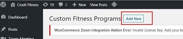
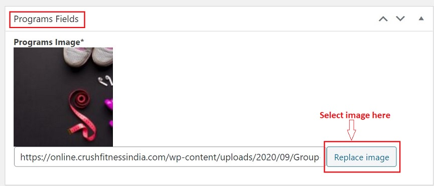
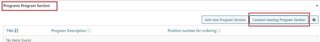
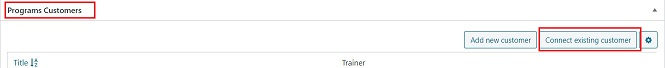
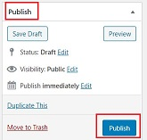

# **Custom Fitness Program**

## **Introduction**

Custom Fitness Program is a personalised training program created manually for individual customers.

Few features to keep in mind about Custom Fitness Program:

-   This is a 1-on-1 personal training program.
-   It is allotted to single customer manually by going to the backend admin panel.
-   A trainer is assigned to the customer. The trainer will discuss the customer's requirement through a questionnaire.
-   Once, the requirements are finalised, a customised program is designed.
-   Only 1 Program Section can be assigned to 1 custom fitness program. 

## **Create Custom Fitness Program**

*   <a href="https://online.crushfitnessindia.com/wp-admin" target="_blank">**Go to online.crushfitnessindia.com**</a>
*   Login with the given credentials.
*   Click on **Custom Fitness Program** tab on left side panel

### **Create new program**

*   Click -> **Add New**

*   Add Title -> Enter name here

   

### **Programs Fields**

*   Programs Image - Here you can upload the program image which will show on the frontend.

### **Programs Program Section**

In this section:

-   Connect existing program section
-   Sequence of the program section should be maintained

1. Click -> **Connect existing Program Section**
2. Choose the program from the list
3. Click -> **Save**

### **Programs Customers**

In this section:

-   Connect existing Customers
-   Sequence of the program should be maintained

1. Click -> **Connect existing customer**
2. Choose the customer name from the list
3. Make sure you choose the customer name with details like email id and phone number.
4. Click -> **Save**

## **Publish**

Once all the connection is done:

-   Click on Publish on the right side panel.
-   Changes will be saved.

## **Warning**

-   Do not allot one customer's program section to the other customer.
-   Doing so, the program section from the original customer's profile will get disconnected.

