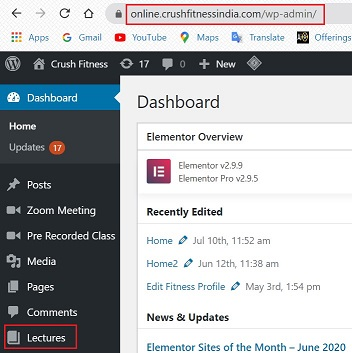
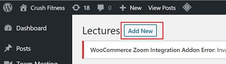
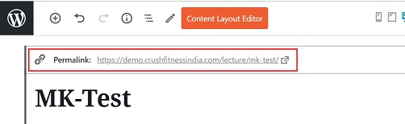
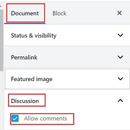

# **Lectures**

## **Introduction**

Lectures are pre-recorded videos or images which can be embedded in specific programs which are part of the Custom Fitness Program.

## **Create Lectures**

*   <a href="https://online.crushfitnessindia.com/wp-admin" target="_blank">**Go to online.crushfitnessindia.com**</a>
*   Login with the given credentials.
*   Click on Lectures tab on left side panel

*   Click on Add New

You will reach the content editor screen.

>   **Gutenberg Blocks**
>
> The content editor page provides different editor blocks known as 'Gutenberg Blocks' which are used to create content layouts in the Wordpress.
>   
>   The Gutenberg editor is a fully block-based editor where each piece of content is a draggable block.
>   
>   By default, WordPress offers a set of basic content blocks like a paragraph, image, button, list, and more. These will be discussed as we move further in this manual.
> 

*   Enter the title of the Lecture.

Once the Title is entered, a link for the lecture is created.

*   In the description block, you can add any content related to the lecture.
*   The tools panel is visible for each content block.

### **Tools Available**

*   Change block type/style

*   Change text alignment

*   Highlight color

*   Add link

*   Text Controls

*   More options

### **Add Block**

- An Add Block is represented by "+" sign in the editor.
- It is a shortcut to access basic formatting options.

-   We will discuss the most common options which can be used to create a lecture.

    1.  Most Used - these are most used paragraph, formatting tools, adding video, audio files.

    

    2.  Commom Blocks - these are most used paragraph, formatting, indenting tools.

    

    3.  Embeds - these provide easy links to third party apps. For eg. youtube, vimeo, twitter, instagram, facebook, spotify etc.

    

    Note: Avoid using the following options:

     -   Formatting
     -   Layout Elements
     -   Widgets
     -   Toolset
     -   WooCommerce Views
     -   WooCommerce

### **Preview**

Once all the content is added to the editor, they can be previewed before the final save.

*   Click on preview on top right corner.

*   You will be able to view how your lecture will be visible on the live website.

## **Right Side Panel**

*   Click on Documents
*   Go to Discussion
*   Check mark "Allow Comments" - This allows customers to add their comments about the lecture.

*   An image can be uploaded in the "Featured Image" option.

## **Publish**

Once all the content is final:

-   Click on Publish on the top right corner.
-   Changes will be saved.

## **Important Tips**

-   Adding content to lectures is similar to writing an email.
-   Anything can be added in the content: text, images, videos, links to thrid party apps etc.
-   All formatting options are available: paragraph, indent, text formatting, heading etc.
-   Do not edit/ make changes to the two sections shown in the image below:

