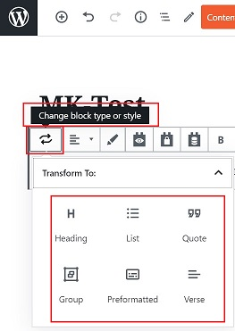
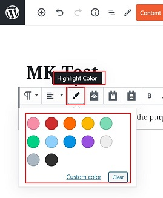

# **Lectures**

## **_Introduction_**

Lectures are pre-recorded videos or images which can be embedded in specific programs which are part of the Custom Fitness Program.

## **_Create Lectures_**

*   Go to online.crushfitnessindia.com/wp-admin
*   Login with the given credentials.
*   Click on Lectures tab on left side panel

*   Click on Add New

You will reach the content editor screen.

>   The content editor page provides different editor blocks known as 'Gutenberg Blocks' which are used to create content layouts in the Wordpress.
>   
>   The Gutenberg editor is a fully block-based editor where each piece of content is a draggable block.
>   
>   By default, WordPress offers a set of basic content blocks like a paragraph, image, button, list, and more. These will be discussed as we move further in this manual.

*   Enter the title of the Lecture.

Once the Title is entered, a link for the lecture is created.

*   In the description block, you can add any content related to the lecture.
*   The tools panel is visible for each content block.

### **_Tools Available_**

*   Change block type/style

*   Change text alignment

*   Highlight color

*   Add link

*   Text Controls

*   More options

