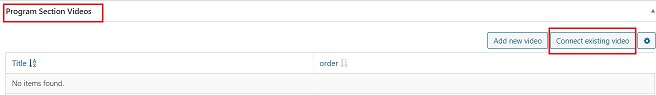
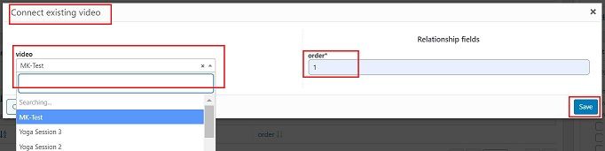

# **Program Section**

## **Introduction**

Program Section is the section which controls the whole system of creating custom fitness programs.

## **Create Program Section**

*   <a href="https://online.crushfitnessindia.com/wp-admin" target="_blank">**Go to online.crushfitnessindia.com**</a>
*   Login with the given credentials.
*   Click on Program Section tab on left side panel

### **Create new program**

*   Click on Add New

*   Add Title

    -   Title should be named as a Weekly program. Eg: Week 1, Week 2 etc.
    -   It is always good to name the program with the name of the customer it is being personalised for.

### **Fields for Program Section**

*   **Program Description**: Here you can enter the detiled description and features about the program.

*   **Position number of ordering**: This is the sequence number of the program.

### **Program Section Lectures**

In this section:

-   Connect existing lectures
-   Sequence of the program should be maintained
-   Multiple lectures can be attached

1. Click on Connect existing lecture
2. Choose the lecture from the list
3. Enter the order number
4. Click on Save

### **Program Section Videos**

In this section:

-   Connect existing videos
-   Sequence of the program should be maintained
-   Multiple videos can be attached

1. Click on Connect existing video
2. Choose the video from the list
3. Enter the order number
4. Click on Save

## **Publish**

Once all the content is final:

-   Click on Publish on the right side panel.
-   Changes will be saved.

## **Important Tips**

-   Each Lecture and video can be part of multiple programs. It follows a 1-to-many relation.
-   In case of a wrong connection:

    - Click on Edit/Quick Edit- this let's you edit the details.
    - Do not click on Trash - this will delete the lecture/video permanently from every program.
    - Click Disconnect

    

-   Do not edit/ make changes to the section shown in the image below:

