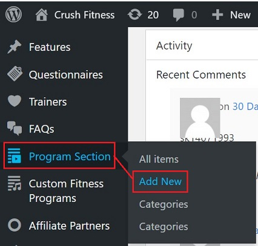
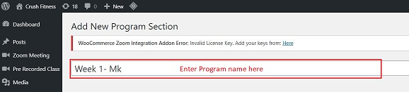
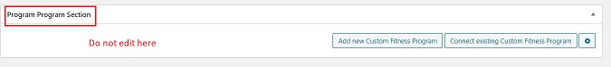

# **Program Section**

## **_Introduction_**

Program Section is the section which controls the whole system of creating custom fitness programs.

## **_Create Program Section_**

*   Go to online.crushfitnessindia.com/wp-admin
*   Login with the given credentials.
*   Click on Program Section tab on left side panel

### **_Create new program_**

*   Click on Add New

*   Add Title

    -   Title should be named as a Weekly program. Eg: Week 1, Week 2 etc.
    -   It is always good to name the program with the name of the customer it is being personalised for.

### **_Fields for Program Section_**

*   Program Description: Here you can enter the detiled description and features about the program.

*   Position number of ordering: This is the sequence number of the program.

### **_Program Section Lectures_**

In this section:

-   Connect existing lectures
-   Sequence of the program should be maintained
-   Multiple lectures can be attached

1. Click on Connect existing lecture
2. Choose the lecture from the list
3. Enter the order number
4. Click on Save

### **_Program Section Videos_**

In this section:

-   Connect existing videos
-   Sequence of the program should be maintained
-   Multiple videos can be attached

1. Click on Connect existing video
2. Choose the video from the list
3. Enter the order number
4. Click on Save

## **_Publish_**

Once all the content is final:

-   Click on Publish on the right side panel.
-   Changes will be saved.

## **_Important Tips_**

-   Each Lecture and video can be part of multiple programs. It follows a 1-to-many relation.
-   In case of a wrong connection:

    - Click on Edit/Quick Edit- this let's you edit the details.
    - Do not click on Thrash - this will delete the lecture/video permanently from every program.
    - Click Disconnect

    

-   Do not edit/ touch the below section shown in the image below:

