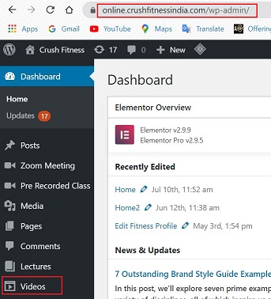
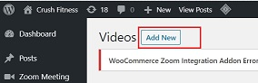
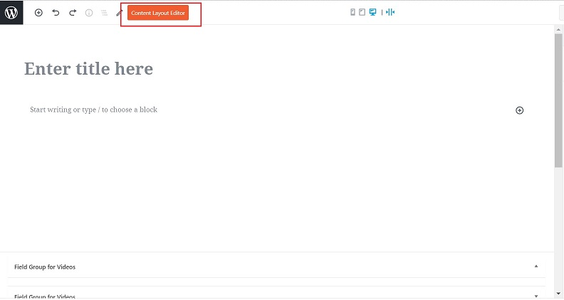
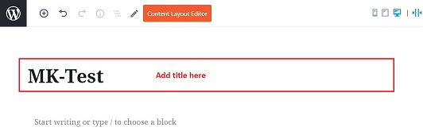
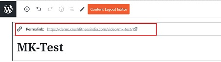
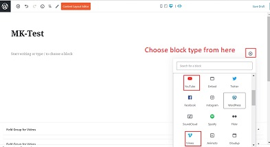
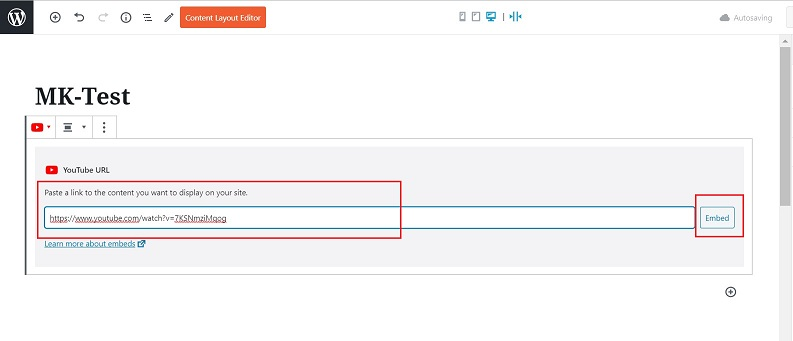
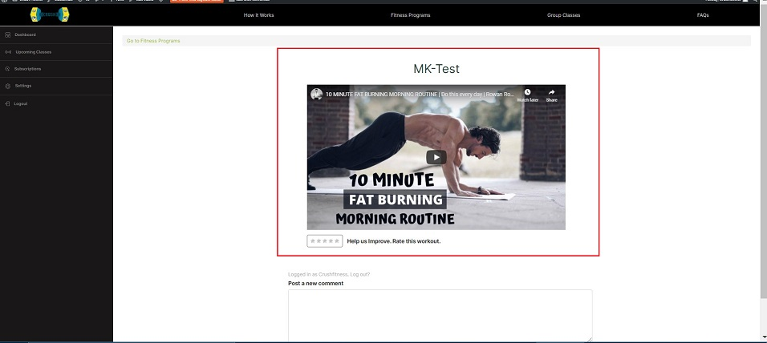
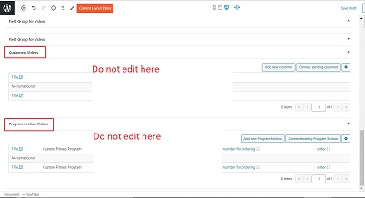

# **Videos**

## **_Introduction_**

Videos are pre-recorded videos which can be embedded in specific programs which are part of the Custom Fitness Program. These videos can be available on third party apps, eg: Youtube, Vimeo etc.

## **_Create Videos_**

*   Go to online.crushfitnessindia.com/wp-admin
*   Login with the given credentials.
*   Click on Videos tab on left side panel

*   Click on Add New

You will reach the content editor screen.

>   **Gutenberg Blocks**
>
> The content editor page provides different editor blocks known as 'Gutenberg Blocks' which are used to create content layouts in the Wordpress.
>   
>   The Gutenberg editor is a fully block-based editor where each piece of content is a draggable block.
>   
>   By default, WordPress offers a set of basic content blocks like a paragraph, image, button, list, and more. These will be discussed as we move further in this manual.
> 

*   Enter the title of the Video.

Once the Title is entered, a link for the Video is created.

*   Add block to insert Video

    -   An Add block is represented by "+" sign in the editor.
    -   It is a shortcut to access basic formatting options.

*   Paste link to the video in the selected block type.
*   Click on Embed.

### **_Preview_**

Once all the video is embedded to the editor, you can preview the final result before saving it.

*   Click on preview on top right corner.

*   You will be able to view how your video will be visible on the live website.

## **_Right Side Panel_**

*   Click on Documents
*   Go to Discussion
*   Check mark "Allow Comments" - This allows customers to add their comments about the lecture.

*   An image can be uploaded in the "Featured Image" option.

## **_Publish_**

Once all the content is final:

-   Click on Publish on the top right corner.
-   Changes will be saved.

## **_Important Tips_**

-   Adding videos is similar to making attachments to an email.
-   There is no requirement to add any text in videos.
-   All formatting options are available: paragraph, indent, text formatting, heading etc.
-   Do not edit/ touch the two sections shown in the image below:

