# **Lectures**

## **Introduction**

Lectures are pre-recorded videos or images which can be embedded in specific programs which are part of the Custom Fitness Program.

## **Create Lectures**

*   Go to <a href="https://www.mycrush.fit/wp-admin" target="_blank">**mycrush.fit/wp-admin**</a>
*   Login with the credentials.
*   Click -> **Lectures** tab on left side panel

    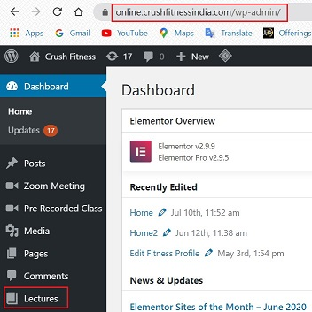

### **Add New**

*   Click -> **Add New**

    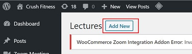

You will reach the content editor screen.

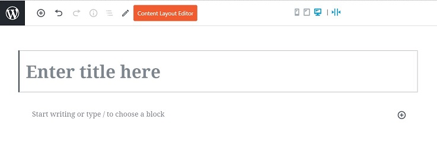

>   **Gutenberg Blocks**
>
> The content editor page provides different editor blocks known as **"Gutenberg Blocks"** which are used to create content layouts in the Wordpress.
>   
>   The Gutenberg editor is a fully block-based editor where each piece of content is a draggable block.
>   
>   By default, WordPress offers a set of basic content blocks like a paragraph, image, button, list, and more. These will be discussed as we move further in this manual.
> 

##  **Lecture Settings**

Follow the instructions below to set up lectures:

### **Add Title**

*   Enter the title of the Lecture.

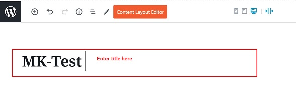

:bulb: **Important Tips for Lecture Title**

-   Name a lecture which is relatable to the program.
-   Try to include the start date of the lecture.
-   Include the type of lecture for better connection.

Below is an example for the Lecture naming system:

Once the Title is entered, a link for the lecture is created.

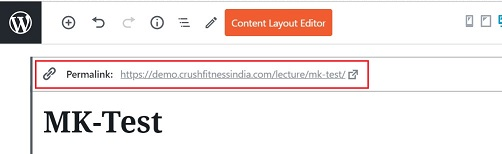

### :pencil2: **Content Editor**

*   In the description block, you can add any content related to the lecture.
*   The tools panel is visible for each content block.

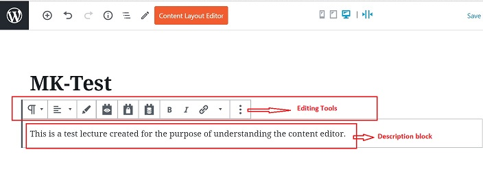

### :hammer_and_wrench: **Tools Available**

Below are the various tools available to edit your content:

####    **Change Block Type/Style**

*   Click the Change block type/style icon. Different style options show, eg: Heading, List, Quote etc.

    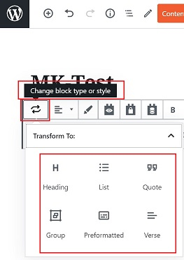

####    **Change Text Alignment**

*   Click the Change text alignment icon - it allows you to align text as you want.

    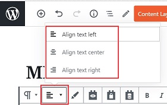

####    **Highlight Color**

*   Click the Highlight color icon - it gives multiple color options to choose from.

    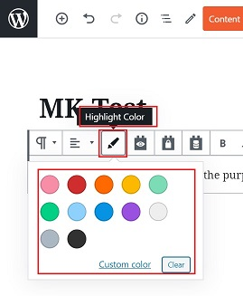

####    **Add Link**

*   Click the Add link icon - this allows you to insert a link to any URL.

    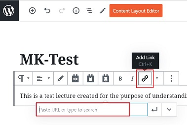

####    **Text Controls**

*   Click the Text Controls icon - it provides multiple options to edit your text.

    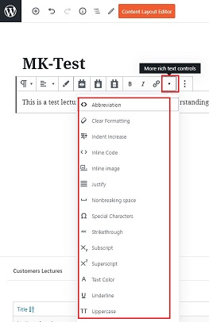

####    **More Options**

*   Click on the icon with 3 vertical dots  to get a list of More options

    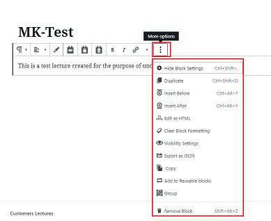

### **Add Block**

- An Add Block is represented by **"+"** sign in the editor.
- It is a shortcut to access basic formatting options.

    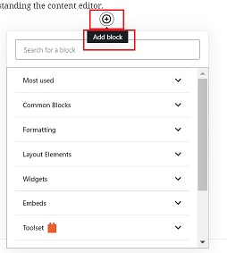

We will discuss the most common options which can be used to create a lecture.

####    **Most Used**

These are most used options - paragraph, formatting tools, adding video, audio files.

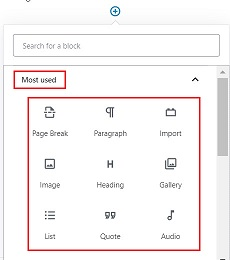

####    **Commom Blocks** 

These are most common used options -  paragraph, formatting, indenting tools.

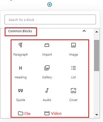

####    **Embeds** 

These provide easy links to third party apps. For eg. youtube, vimeo, twitter, instagram, facebook, spotify etc.

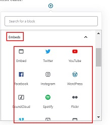

:memo: **Note: Avoid using the following options:**

-   Formatting
-   Layout Elements
-   Widgets
-   Toolset
-   WooCommerce Views
-   WooCommerce

### **Preview**

Once all the content is added to the editor, they can be previewed before the final save.

*   Click on preview on top right corner.

    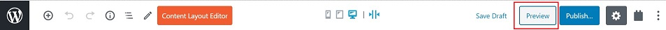

*   You will be able to view how your lecture will be visible on the live website.

    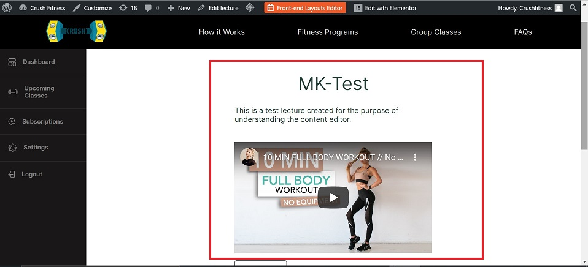

### **Documents Tab**

Under the Documents tab on the right side panel, following changes can be done if required:

####    **Discussion**

*   Go to -> **Discussion**
*   Tick :white_check_mark: **"Allow Comments"** - This allows customers to add their comments about the lecture.

    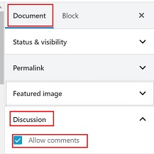

####    **Featured Image**

*   An image can be uploaded in the **"Featured Image"** option.
-   Click -> **Set Featured Image** to add image.

    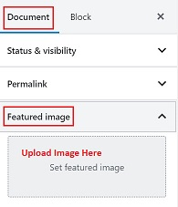

## **Publish**

Once all the content is final:

-   Click on **Publish** on the top right corner.
-   Changes will be saved.

    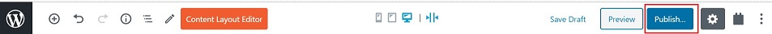

## :bulb: **Important Tips**

-   Adding content to lectures is similar to writing an email.
-   Anything can be added in the content: text, images, videos, links to thrid party apps etc.
-   All formatting options are available: paragraph, indent, text formatting, heading etc.

##  :no_entry_sign: **Do not edit sections**

Do not edit/make changes to the two sections shown in the image below:

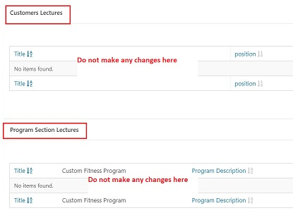

