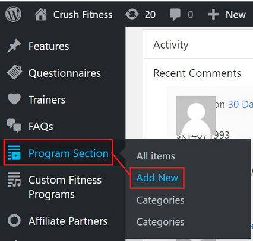
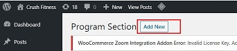
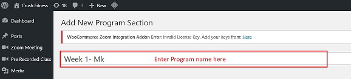
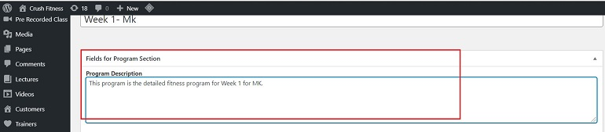
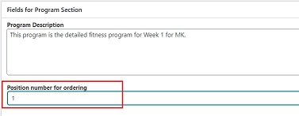
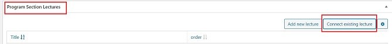
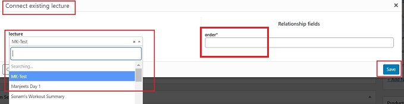
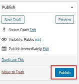
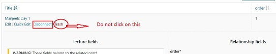
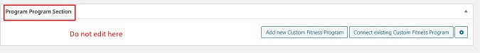

#   **Program Section**

##  **Introduction**

Program Section is the section which controls the whole system of creating custom fitness programs.

## **Create Program Section**

*   <a href="https://online.crushfitnessindia.com/wp-admin" target="_blank">Go to **online.crushfitnessindia.com**</a>
*   Login with the credentials.
*   Click -> **Program Section** tab on left side panel

    

*   Click -> **Add New**

    

##  **Program Section Settings**

Below settings will help in adding new program sections:

### **Add Title**

*   Enter a title for the program. Keep the below tips in mind while naming the title:

    -   Title should be named as a Weekly program. Eg: Week 1, Week 2 etc.
    -   It is always good to name the program with the name of the Program it is being personalised for.

    

An example is below:

### **Fields for Program Section**

Below fields to be edited:

####    **Program Description**

Enter the detailed description and features about the program.

####    **Position number of ordering**

This is the sequence number of the program.

### **Program Section Lectures**

In this section:

-   Connect existing lectures to the respective program section.
-   Sequence of the program should be maintained
-   It follows the Many-to-1 model : Multiple lectures can be attached to a single Program Section
-   Also, 1 lecture can be connected to multiple Program sections.

####    **Connect Existing Lecture**

1. Click -> **Connect existing lecture**
2. Choose the lecture from the list
3. Enter the order number - this decides the sequence/position of the lectures. 
4. Click on **Save**

    

The final look - This is how the connected lectures appear on the frontend:

### **Product Categories**

To club multiple Program Sections under a plan, assigning a Product Category to every Program section created is a key requirement.

**Under the Personal Fitness, each product created should have a sub-category with the same name.**

Follow the below steps to select category:

1.  Go to -> **Product Categories**
2.  Select -> **Personal Fitness** always as the Parent category.
3.  Select -> Sub-category with the same name as the Product.

>   :memo: **Note - It is very important to select the sub-category with the same name as the Product**

## **Publish**

Once all the content is final:

-   Click on **Publish** on the right side panel.
-   Changes will be saved.

    

## :bulb: **Important Tips**

-   Each Lecture can be part of multiple programs. It follows a 1-to-many relation.
-   In case of a wrong connection:

    - Click on Edit/Quick Edit- this let's you edit the details.
    - Do not click on Trash - this will delete the lecture/video permanently from every program.
    - Click Disconnect

    

##  :no_entry_sign: **Do not edit sections**

Do not edit/make changes to the section shown in the image below:

