# **Pre Recorded Class**

## **_Introduction_**

Pre-Recorded Class is an interactive class which enables the customers to take care of their fitness goals from anywhere, anytime.

These are pre-recorded sessions hosted on Vimeo, for which the Crush Fitness India adminstrator can upload the link on the website.

Below is the step-by-step guide to create Pre-Recorded Class.

## **_Create Pre Recorded Class_**

*   Go to online.crushfitnessindia.com/wp-admin
*   Login with the given credentials.
*   Click on Pre Recorded Class on left side panel

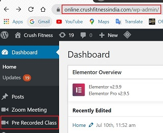

*   Click on Add new

*   Enter Name of Class

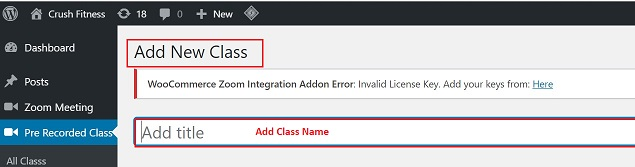

*   Go to Recorded Class Details:

    *   Add Video URL:

        1.  Go to Vimeo.com
        2.  Click on the required video
        3.  Copy the video link
        4.  Paste in the Video Url field

    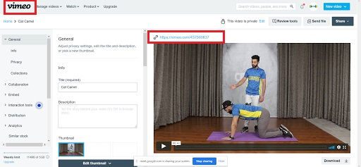
    
    *   Add Video Duration - always enter duration in minutes.
    *   Enter Start Date/Time - 

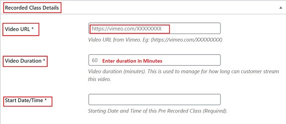  

## **_Right Side panel_**

1.  Tick the Enable Purchase check box

    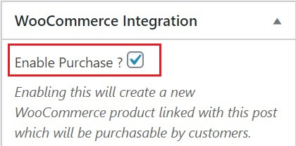

2.  CLick on Regular Price and enter an amount

    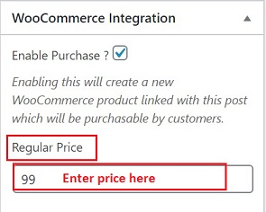

3.  Click on Publish

    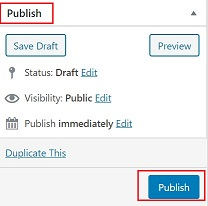

4.  Once the meeting is published, a Product id & Product Name is created.

    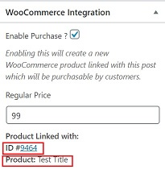

## **_Create Product for the related Product id_**

Click on the Product id. You will be directed to the Product screen.

*   On the Product page:

    1.  Enter name in the Product Name field. This is the name that would be visible to the customers

    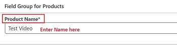

    2.   Go to Product Field:

    *   Enter the Date and time of the class

    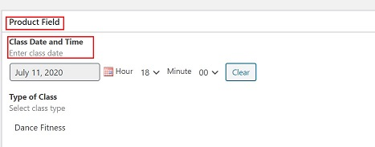

    *   Enter type of class

    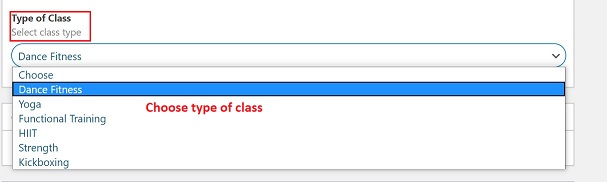

    3.   Go to Product Data -> Group Video Class

    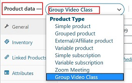

    4.  Check and confirm all details in the Group Video Class section.

    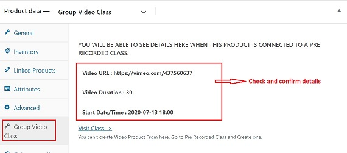

    
*   Product page -> Right side panel:

    1.  Go to Product Categories 
    2.  Uncheck the "Uncategorized" box
    3.  Check Group Fitness -> Pre Recorded Class

    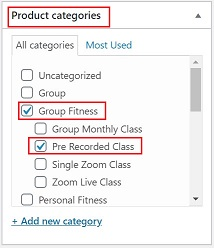

## **_Publish_**

*   Click Publish to save the settings.

## **_Note_**

All the Pre-recorded Classes card from the dashboard are set to expire/stop exactly at double the time of the class duration.

Class Validity = (Class duration in minutes)*2

E.g. If the duration of class is 30 minutes, then the Card will be visible on the dashboard for 60 mins.

