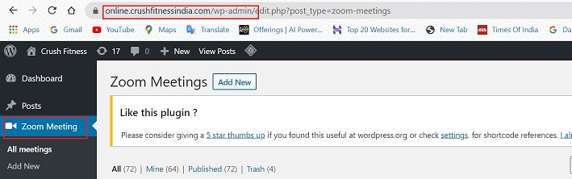
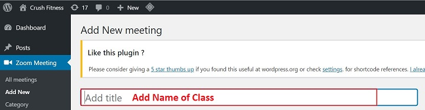
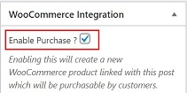

# **Zoom Single Class**

## **Introduction**

Zoom class is an interactive class which enables the customers to take care of their fitness goals from anywhere, anytime.

Below is the step-by-step guide to create Zoom Classes.

## **Create Zoom meeting**

*   <a href="https://online.crushfitnessindia.com/wp-admin" target="_blank">**Go to online.crushfitnessindia.com**</a>
*   Login with the given credentials.

### **Left Side Panel**

*   Click -> **Zoom Meeting** 

*   Click -> **Add new**

*   Add Title -> Enter Name of Class 

*   Enter Start Date & Time
*   Enter Duration
*   Enter Password to join meeting

*   Check mark the below options:

    *   Join Before Host
    *   Participant Video
    *   Mute Participants Upon Entry

### **Right Side Panel**

Options to be edited on the right side panel are discussed below:

-   Go to -> **Category**
-   It should be marked as "**Group**"

*   Tick the **Enable Purchase** check box

*   Click on **Regular Price** and enter an amoumt

*   Click on **Publish**

*   Once the meeting is published, a **Product id** is created. 

##  **Attaching Template against a Product**

1.  Go to -> the respective class
2.  Click -> Edit

    

3.  Go to -> Right Side Panel 

### **Product Categories** 

-   Group Fitness -> Select the Template with the same name to be connected with the product.

    

**Note** - **Do not select the Parent Category here**

### **WooCommerce Integration** 

-   Click -> **Product Id#** - you will be directed to the edit product page.

    

####    **_Left Side Panel_ - Visibility** 

- Tick the check box to enable Homepage Visibility. This is a very **important and mandatory** step.

    

####    **_Left Side Panel_ - Product Template**

This is the last section located at the bottom of the page. Follow below steps:

-   Click -> **Connect existing Product Template**
-   From the list select the corresponding template.

####    **_Right Side Panel_ - Product Categories**

-   Select **only** the Parent Category here.

    

## **Publish/Update**

*   Click Update to save the changes.

## **Note**

All the Zoom Classes card from the dashboard are set to expire exactly at 2 hours, after the class has first started.