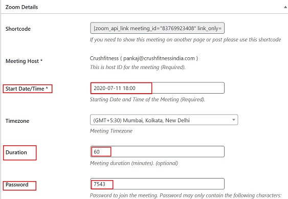
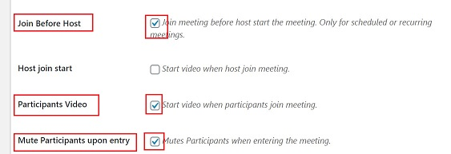
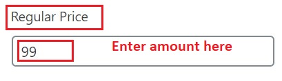

# **Zoom Single Class**

## **Introduction**

Zoom class is an interactive class which enables the customers to take care of their fitness goals from anywhere, anytime.

Below is the step-by-step guide to create Zoom Classes.

## **Create Zoom meeting**

*   <a href="https://online.crushfitnessindia.com/wp-admin" target="_blank">Go to **online.crushfitnessindia.com**</a>
*   Login with the credentials.
*   Click -> **Zoom Meeting** 

    

### **Add New**

-   Click -> **Add New** to create a new class

    

##  **Zoom Meeting Settings**

The following fields should be populated/edited for a Zoom meeting:

### **Add Title** 

-   Enter Name of Class 

    

### **Start Date/Time**

*   Enter Start Date & Time. Date format used: yyyy-mm-dd

### **Duration**

*   Enter the meetng Duration in minutes.

### **Password**

*   Enter Password to join meeting

### **Options to Select/tick mark**

Tick :white_check_mark: the check boxes for the below options:

*   Join Before Host
*   Participant Video
*   Mute Participants Upon Entry

### **Enable Purchase**

*   Go to -> **WooCommerce Integration** on right side panel   
*   Tick :white_check_mark: the **Enable Purchase** check box

    

### **Regular Price**

*   Go to -> **WooCommerce Integration** on right side panel    
*   Click on **Regular Price** 
*   Enter an amoumt

    

### **Product Categories** 

-   Go to -> **Product Categories** on right side panel
-   Select :white_check_mark: the Product Template with the same name to be connected with the product.

    

:memo: **Note** - **Do not select the Parent Category here**

### **Publish**

*   Click on **Publish** to save the changes

    

*   Once the meeting is published, a **Product id** is created. 

    

-   Click -> **Product Id#** - you will be directed to the product page.

    

##  **Product Page**

On the product page, the following options need to be edited:

###    **Visibility** 

-   Tick :white_check_mark: the check box to enable Homepage Visibility. This is a very **important and mandatory** step.

    

###    **Product Categories**

-   Go to -> **Product Categories** on right side panel
-   Select :white_check_mark: **only** the Parent Category (Group Fitness) here.

    

###    **Product Template**

This is the last section located at the bottom of the page. It allows the integration between a Product/Class and product template. Follow below steps:

####    **Connect Existing Product Template**

-   Go to -> **Product Template**
-   Click -> **Connect existing Product Template**
-   From the list select the corresponding template.

    

## **Update**

*   Click **Update** to save the changes.

    

## **Note**

All the Zoom Classes card from the dashboard are set to expire exactly at 2 hours, after the class has first started.